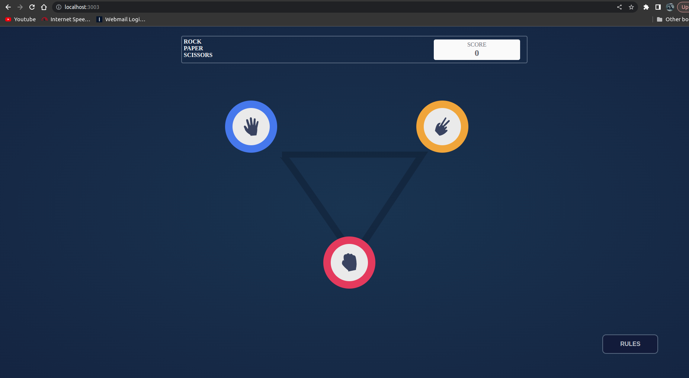

# rock-paper-scissors

## Project setup

You need docker and docker-compose cli to run this project, run the following in project's root:
```
docker-compose up --build
```

Then navigate to http://localhost:3003:


